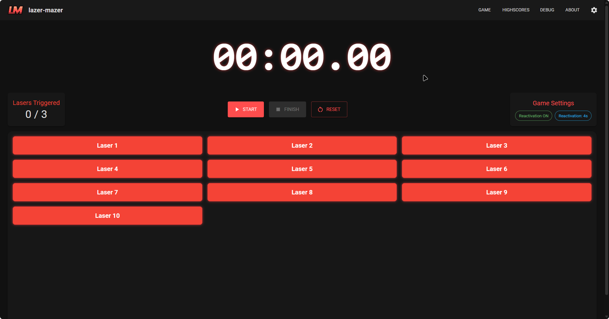
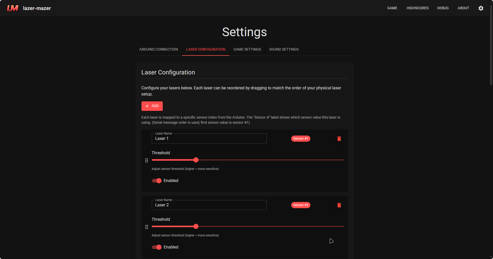

# lazer-mazer: DIY Interactive Laser Maze Game


[](https://github.com/L3-N0X/lazer-mazer/releases)
[](https://github.com/L3-N0X/lazer-mazer/issues)
[](https://github.com/L3-N0X/lazer-mazer/pulls)

Bring the thrill of a laser maze to your home with lazer-mazer!

This project combines a custom-built Arduino-based sensor system with a user-friendly Tauri application to create an engaging and customizable experience.

## Overview

lazer-mazer allows you to design, build, and play your own laser maze. The system uses laser pointers and light-dependent resistor (LDR) sensors connected to an Arduino to detect when a laser beam is broken. The Tauri application provides a rich user interface for configuring the game, calibrating sensors, and tracking scores in real-time.

## Screenshots


The start screen

The main screen of the application, showing which lasers were broken by the player, current game mode, timer and more.

The settings screen, where you can configure the game mode, laser configuration, and serial port settings as well as sound settings.

## Features

* **Simple & Intuitive Interface:** Easily configure your laser maze setup and start playing in minutes.
* **Customizable Game Mode:** Configure the number of laser beams that are allowed to be broken and choose if lasers can reactivate after being broken.
* **Stop Timer:** Use a buzzer button to stop the timer and record your time.
* **Almost Real-time Sensor Feedback:** Get instant feedback when a laser beam is broken.
* **Arduino-based Hardware Integration:** Seamlessly integrates with your DIY laser maze components and sensors.
* **Debug & Configuration Tools:** Calibrate and test your sensors through the debug interface for optimal performance.
* **Highscore tracking:** Keep track of your best times and challenge your friends.

## Hardware Requirements

* Arduino board (e.g., Arduino Mega 2560)
* Laser pointers
* Light-dependent resistors (LDRs)
* Resistors (for LDR voltage dividers)
* Connecting wires
* (Optional) Start/Stop Buttons

## Getting Started

### 1. Set Up the Arduino

1. **Connect the LDR Sensors:** Connect the LDR sensors to the Arduino using voltage dividers. Ensure each sensor is connected to a separate analog pin.
2. **Connect the Start/Stop Buttons:** Connect the start and stop buttons to the Arduino. The start button should be connected to a digital pin, and the stop button should be connected to another digital pin.
3. **Upload the Arduino Sketch:** Upload the Arduino sketch to your Arduino board. The sketch is responsible for reading sensor data and sending it to the Tauri application via serial communication. You can find the Arduino sketch in the `src-arduino` directory.

When developing your own Arduino sketch, make sure to follow the data format required by the Tauri application (see "Data Format" below).

### 2. Data Format (Serial Communication)

The Arduino communicates with the Tauri application via serial communication. The data format is crucial for the application to correctly interpret sensor readings.

* **Start Button:** Sends the string `"start"` when the start button is pressed.
* **Buzzer Button:** Sends the string `"buzzer"` when the buzzer button is pressed (used to stop the timer).
* **Sensor Readings:** Sends comma-separated values representing the LDR sensor readings. Values range from 0 to 1023.

  * Example: `123,456,993,1023,6,564` (representing 6 LDR sensor values)

It will always send one of the above messages, separated by a newline character (`\n`), with a very small delay between each message.

### 3. Installation

1. Download the latest release from [Releases](https://github.com/L3-N0X/lazer-mazer/releases).
2. Follow the installation instructions for your operating system.

### 4. Configuration

1. **Connect to Serial Port:** In the application settings, select the correct serial port for your Arduino.
2. **Laser Configuration:**
   * Adjust the laser configuration to match your physical room setup. This involves reordering each sensor to its corresponding laser beam and you can also set names for each sensor.
   * Set the threshold values for each sensor. The threshold determines when a laser beam is considered "broken." This will depend on the ambient light in your room and the strength of your lasers.

---

## Software Requirements (For Developers)

* [Node.js](https://nodejs.org/)
* [pnpm](https://pnpm.io/)
* [Rust](https://www.rust-lang.org/)
* [Tauri CLI](https://tauri.app/v1/guides/getting-started/prerequisites)

### 5. Run the Application

* For development (Developers only, requires the software requirements to be installed):

  ```bash
  pnpm tauri dev
  ```

* For building (Developers only, requires the software requirements to be installed):

  ```bash
  pnpm tauri build
  ```

## Contributing

Contributions are welcome! Please feel free to submit pull requests or open issues to suggest improvements or report bugs.
